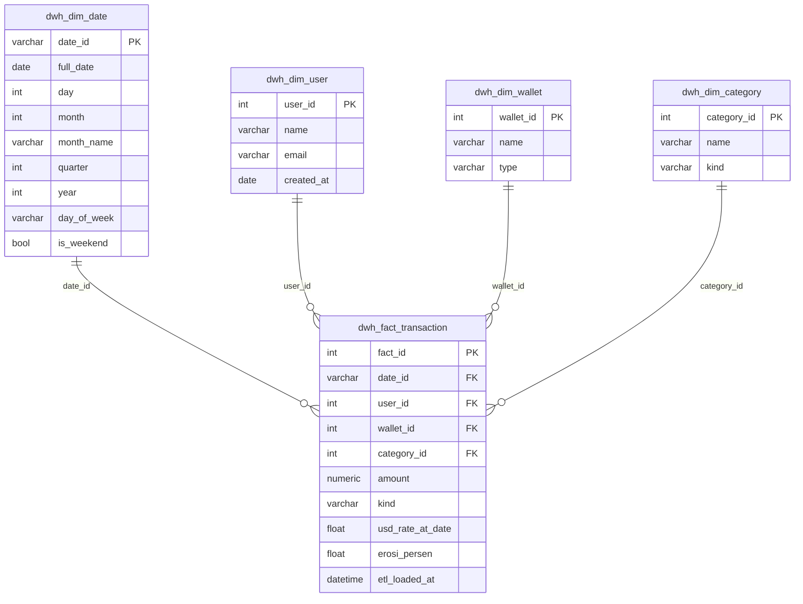
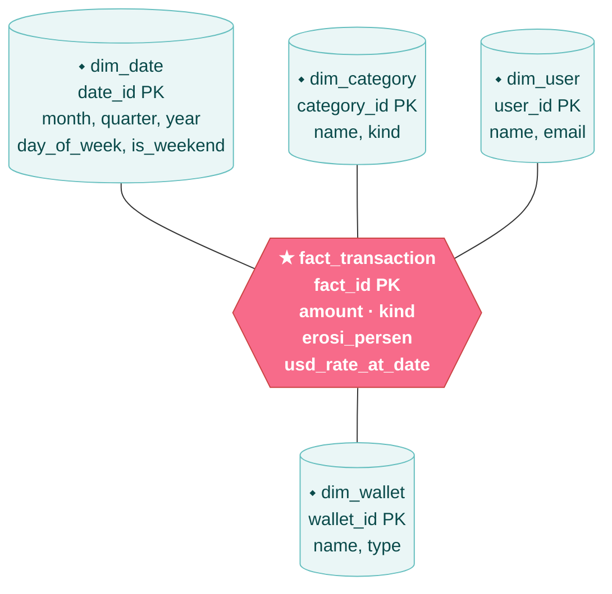
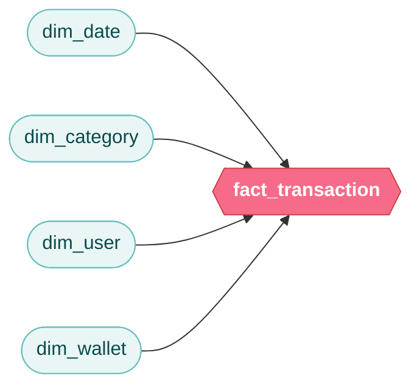

# Diagram Star Schema ReTrack (Mermaid) — untuk Slide 8

> Render di: editor Markdown yang mendukung Mermaid (VS Code + ekstensi Mermaid),
> GitHub, atau **https://mermaid.live** → ekspor PNG/SVG untuk ditempel ke PPT.

---

## Versi 1 — ER Diagram (RECOMMENDED, paling jelas untuk PPT)

Menampilkan kolom tiap tabel + relasi fakta→dimensi (bentuk bintang).



---

## Versi 2 — Flowchart bentuk bintang (lebih visual "star")

Fakta di tengah, 4 dimensi mengelilingi → terlihat seperti bintang.



> Warna mengikuti palet ReTrack: fakta = pink `#F76B8A` (aksen), dimensi = teal muda `#EAF6F6` (brand).

---

## Versi 3 — Ringkas (tanpa kolom, untuk slide minimalis)



---

### Cara ekspor ke gambar untuk PPT
1. Buka **https://mermaid.live**
2. Tempel salah satu blok kode di atas (tanpa baris ```mermaid)
3. Klik **Actions → PNG/SVG** → tempel ke slide 8.

Saran: **Versi 1 (ER)** untuk menjelaskan detail kolom, atau **Versi 2** bila ingin bentuk bintang yang jelas secara visual.
